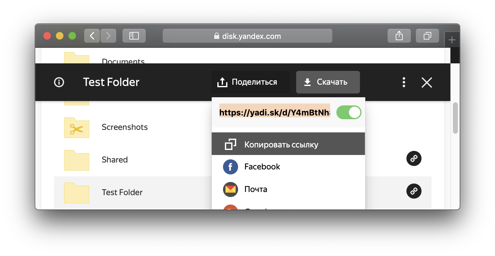

# Access Yandex Disk Public Files Using Official REST API
*Tags: #yandexdisk #javascript #react * 

How to access publicly shared files via the Yandex.Disk REST API. This approach doesn't require an API key.

## Share Folder
Share Folder as following:


## API Calls
In the [Official Documentation for the Yandex.Disk REST API](https://tech.yandex.com/disk/api/concepts/about-docpage/) we are interested in the section [Actions with public files and folders](https://tech.yandex.com/disk/api/reference/public-docpage/).

The endpoint is:
```
https://cloud-api.yandex.net/v1/disk/public/resources
```

Then, one of the URL query parameters is *public_key* in our case it is the link which we got from the Yandex Disk Web Interface, as shown in the picture above, for example: [https://yadi.sk/d/Y4mBtNh8on_G7Q](https://yadi.sk/d/Y4mBtNh8on_G7Q).

If do the HTTP request as following:
```
Request
  GET /v1/disk/public/resources/ HTTP/1.1
Query String Parameters
  public_key: https://yadi.sk/d/PB0WCovt4v-Tkg
```
The resulting URL is `https://cloud-api.yandex.net/v1/disk/public/resources/?public_key=https%3A%2F%2Fyadi.sk%2Fd%2FPB0WCovt4v-Tkg`

The URL (public key) has to be URLencoded, for example using a JavaScript function, you can simply use a developer console of a browser:
```
encodeURIComponent("https://yadi.sk/d/PB0WCovt4v-Tkg")
```

To make this part easier, you can use a REST client, I use [Insomnia](https://insomnia.rest).

If the shared entity is a folder, in the response we are interested in field *_embedded.items* which contains list of the files in the folder.

And every entity has *path* and *name* fields.

We can repeat a request to the endpoint `https://cloud-api.yandex.net/v1/disk/public/resources` with the samee *public_key* and *path* query parameter or with the *public_key* of the element in *_embedded.items*, if the entity is a folder.

If the entity is a file, we can get a download link, using the endpoint:
```
https://cloud-api.yandex.net/v1/disk/resources/download
```

In the same way, we specify *public_key* of the file, or *public_key* of the folder and the *path*.

## React code
In order to perform a GET request, install the Axios library:
```
npm i axios
```

